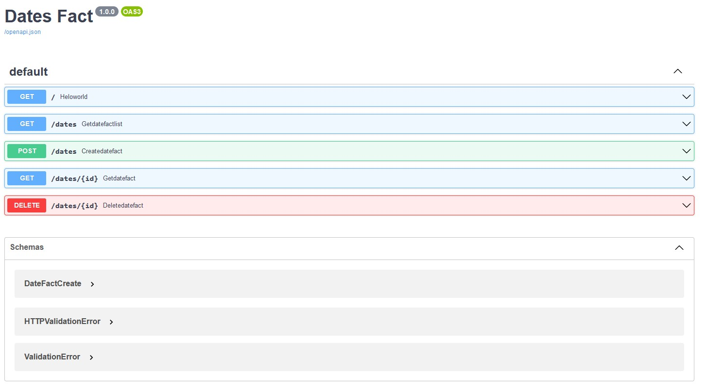

# DateFact 
 - Date fun fact 

## How to Use

### Prerequisites
Make sure you have a modern version of `docker` (>1.13.0)and `docker-compose` installed.

### Run with Docker Compose
Simply run `docker-compose up --build` to spin up all the services on your local machine.

### Test App Open End-Point
* Hit and verify `Hello World` response by opening app link in browser:

```bash
curl --location --request GET 'http://localhost:8000/'
```
### API  verification

Open and find API the documentation in browser `http://localhost:8000/`.
### Interactive API documentation

[](https://github.com/rajasekark54/FastAPI_DatesFact)